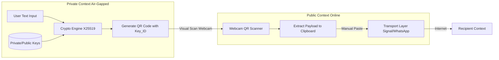
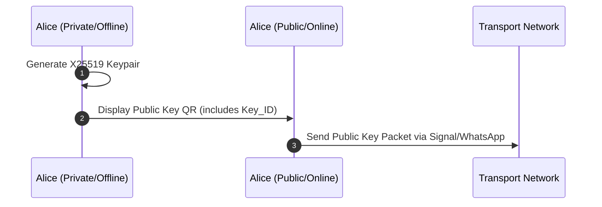
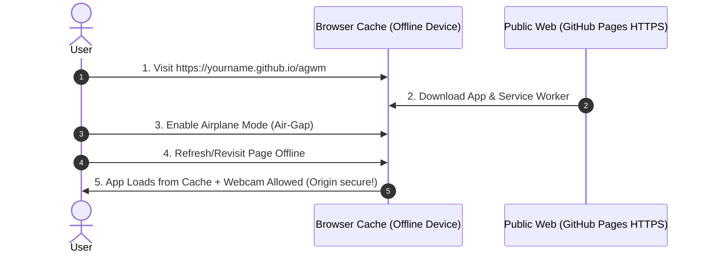

# Air-Gapped Messenger (AGM)

## Architectural Design & Specification

### 1. Concept Statement

An asymmetric, ultra-secure messaging system that eliminates operating-system and network-based attack vectors by isolating cryptographic key generation, message encryption, and decryption on a device physically disconnected from the internet (*air-gapped*). The system leverages a 100% web-based architecture (Vanilla JS/HTML5) to maximize accessibility and deployment ease. It utilizes existing commercial messaging networks (e.g., Signal, WhatsApp) as blind data transport relays ("postmen") for encrypted, anonymized payloads via effortless QR code scanning and clipboard orchestration.

---

### 2. Problem Statement

Modern communication channels expose high-risk users to three critical threat vectors:

1. **Key Compromise:** If an internet-connected device is infected with malware, private cryptographic keys can be exfiltrated silently.
2. **Operating System:** If an internet-connected device is infected with malware, unencrypted messages can be accessed from memory or from the frame buffer.
3. **Metadata Harvesting:** Even with End-to-End Encryption (E2EE), network providers and state actors log the social graph—tracking who communicates with whom, when, and how frequently.

Traditional air-gapped systems mitigate key compromise but introduce extreme friction, requiring manual string transcription, specialized hardware, or proprietary network deployments that are unsustainable for casual or rapid deployment.

---

### 3. Core Architectural & Security Principles

To guarantee uncompromised privacy and security, all present and future developments in the AGM ecosystem must strictly adhere to these foundational principles:

1. **Absolute Private Key Isolation:** Private cryptographic keys must be generated, stored, and used exclusively on the air-gapped device. They must **never** be exfiltrated, exported, or exposed to any online or relay device under any circumstances.
2. **Device-Enclosed Cryptography:** All encryption, decryption, payload sealing, and signature verification operations occur strictly on the air-gapped terminal. Online relays act solely as blind data transport couriers ("postmen") with zero knowledge or access.
3. **Metadata Minimization:** Unencrypted plaintext data and transport headers (such as `Key_ID` hints or protocol version tags) must be kept to the absolute minimum necessary for key lookup and routing by the recipient air-gapped device.
4. **Security & Privacy Over Ergonomics:** While user experience and relay convenience are valued, security, privacy, and air-gap integrity are paramount and take absolute precedence whenever a design trade-off occurs.
5. **Exchange Medium Fungibility:** The physical exchange medium between the air-gapped device and the online relay (or between air-gapped devices) must remain transport-agnostic and fungible. Payloads should be exchangeable via optical channels (QR codes), acoustic data-over-sound (ultrasound), light (infrared/IR), physical hardware (USB), haptics/vibrations, or file transfer.
6. **Plausible Deniability:** The protocol and system architecture must support plausible deniability (e.g., hidden cryptographic vaults, duress PINs, dummy identity keyrings, untraceable payload structures).
7. **Defense-in-Depth & Layered Security:** The system design must accommodate optional modular security layers, such as steganography (hiding encrypted payloads inside images, audio, or benign text) and outer cover ciphers.
8. **Maximum Serialization & Payload Efficiency:** Packets and payload structures must be as byte-dense and lightweight as possible. Inefficient text wrappers (such as Base64 string encoding inside JSON objects) must be avoided for binary data or file transfers. Native binary serialization formats (such as Protocol Buffers / Protobuf or CBOR) should be preferred to maximize data density per frame, reduce transmission latency, and optimize bandwidth across constrained air-gap channels (optical QR codes, acoustic ultrasound, or IR).

---

### 4. Conceptual Design

#### Architecture Overview

The system splits operations between two execution contexts running the exact same Application, distinguished only by their network state.



#### Core Components & Device Roles

1. **Private Context (Offline / Air-Gapped Device):**
* **Role:** Key custodian and secure terminal.
* **Functions:** Generates public/private key pairs, stores peer public keys locally, encrypts outgoing plaintext, and decrypts incoming ciphertexts.
* **Network State:** Permanent airplane mode. For demo purposes, intially loaded once via HTTPS, then disconnected. Full airgap mode is possible by serving the html via local micro-server, to get around browser camera restrictions.  


2. **Public Context (Online / Sender-Relay Device):**
* **Role:** Automated data courier.
* **Functions:** Scans outgoing QR codes from the Private Device, auto-copies payloads to the system clipboard, and displays incoming network payloads as QR codes for the Private Device to consume.
* **Network State:** Connected to the internet. **Zero knowledge** of private keys.


#### Plausible Deniability & Layered Envelope Architecture

To guarantee 100% metadata privacy and plausible deniability against traffic analysis and device seizure, the protocol uses a **Layered Envelope Architecture** separating the **Inner Cryptographic Layer** (pure opaque blob) from the **Outer Transport Layer** (ephemeral streaming frame).

```
┌────────────────────────────────────────────────────────────────────────────┐
│ OUTER TRANSPORT LAYER (Ephemeral Optical Streaming Frame)                  │
│ [ Chunk Index | Total Chunks | Fountain Seed ] [ Encrypted Chunk Slice ]   │
└─────────────────────────────────────┬──────────────────────────────────────┘
                                      │ Camera uses sequence info to assemble
                                      ▼
┌────────────────────────────────────────────────────────────────────────────┐
│ INNER CRYPTOGRAPHIC LAYER (Pure Opaque Blob - 100% High Entropy Noise)     │
│ ┌────────────────────────────────────────────────────────────────────────┐ │
│ │ Encrypted: [ Ephemeral X25519 PubKey | XSalsa20-Poly1305 Ciphertext ]  │ │
│ │ Plaintext Unpacked: [ Optional Filename | Payload Bytes | Signature ]  │ │
│ └────────────────────────────────────────────────────────────────────────┘ │
└────────────────────────────────────────────────────────────────────────────┘
```

##### 1. Inner Cryptographic Layer (The Opaque Blob)
* **High-Entropy Indistinguishability:** Encrypted payloads contain **zero magic bytes**, **zero plaintext headers**, and **zero key IDs (`kid`)**. To any network observer, relay, or forensically seized device, the blob is mathematically indistinguishable from random noise or a corrupted file.
* **Header-Only Trial Decryption:** To decrypt opaque payloads without compromising metadata privacy, the receiving air-gapped device executes **Header-Only Trial Decryption**:
  * Payloads use a hybrid structure containing a tiny 32-byte encrypted symmetric key header (authenticated via Poly1305 MAC) at the head of the ciphertext.
  * The receiving device iterates through its stored contact keypairs, attempting key exchange and MAC verification **only on this tiny 32-byte header block**.
  * Wrong keys fail the Poly1305 MAC check in $<0.05$ ms and abort immediately **without decrypting or touching the large file payload**.
  * Only when the 32-byte header MAC check succeeds does the device proceed to stream and decrypt the main payload once. Decrypting a multi-megabyte file across 50 contact keys introduces $<2.5$ ms of total computational overhead.
* **Plausible Deniability:** Under coercion, a user can plausibly claim the string or file is random garbage data. An adversary cannot prove decryption is possible without holding the recipient's private key.

##### 2. Outer Transport Layer (Ephemeral Streaming Envelope)
* **Purpose:** Enables optical air-gap streaming when payloads exceed single QR capacity (e.g. multi-megabyte files).
* **Header Structure:** `[ Chunk Index | Total Chunks | Fountain Seed / Checksum ]`.
* **Zero Identity Leakage:** Contains zero real-world names, key IDs, or filenames.
* **Ephemeral Lifecycle:** Exists **only on screens during physical camera scanning**. The Sender Relay strips it off upon scanning, leaving only the pure Opaque Inner Content for network dispatch. The Receiving Relay regenerates fresh outer transport frames on-the-fly when displaying an animated QR stream to the receiving air-gapped device.

---

#### Flexible Relay Dispatch Options (Text vs. Files)

Depending on payload size and user preference, the Public Relay device provides flexible dispatch modes to forward the pure opaque inner content across commercial messengers (Signal, WhatsApp, Telegram):

| Payload Type | Size / Constraint | Relay Dispatch Mode Options | Network Transport Appearance |
| :--- | :--- | :--- | :--- |
| **Small Text Message** | Fits in 1 QR ($\le 1.5$ KB) | **1. Base64 / Hex Text:** Pasted directly into messenger chat input.<br>**2. PNG QR Image:** Shared as standard photo attachment via Share Sheet / Clipboard. | Looks like a standard string paste or image attachment. Zero protocol headers. |
| **Large File / Document** | Exceeds 1 QR ($> 1.5$ KB) | **Raw Binary File Attachment:** Dispatched as a generic binary file (e.g. `.bin` or `.dat`, **never `.agm`**). | Looks like an arbitrary encrypted file transfer. |

---

### 5. Application Workflows

#### Key Exchange Procedure (Initial Setup)

Before secure messaging begins, users execute a one-time cryptographic handshake:



#### Workflow A: Outbound Message (Private $\rightarrow$ Public $\rightarrow$ Network)

1. **Private Terminal:** User selects a peer, types a message, and clicks "Encrypt". The app fetches the peer's Public Key, seals the payload, appends the target `Key_ID` to the metadata, and renders the JSON string as a QR code.
2. **Public Relay:** The online device scans the QR code via the browser webcam. The app parses the JSON, flashes a success indicator, and **automatically copies the `pay` string directly to the device clipboard**.
3. **Dispatch:** The user switches to their preferred native messaging app (Signal/WhatsApp), enters the recipient's chat room, pastes the clipboard contents, and clicks send.

#### Workflow B: Inbound Message (Network $\rightarrow$ Public $\rightarrow$ Private)

1. **Public Relay:** The user copies the incoming encrypted string from Signal/WhatsApp, opens the AGM Web App, and pastes it into the incoming terminal interface. The Web App converts this data into a fullscreen QR code.
2. **Private Terminal:** The user scans the public display using the offline device's webcam.
3. **Decryption:** The offline app extracts `meta.kid`, locates the matching private key in its local browser state, decodes the ciphertext payload, and prints the plaintext message to the screen.

---

### 6. Technical Stack & Browser Sandbox Mitigations

#### Chosen Framework: Vanilla JavaScript + Vite

* **Language:** JavaScript (ES6+), HTML5, CSS3
* **Deployment Target:** Web (Static SPA optimized for offline execution).
* **Cryptographic Layer:** `tweetnacl.js` executing standard public-key authenticated encryption. Specifically:
  * **Key Exchange:** X25519 (Curve25519)
  * **Symmetric Encryption:** XSalsa20
  * **Message Authentication (MAC):** Poly1305
  * **Key ID Hashing:** SHA-512 (first 8 bytes)

#### Bypassing Browser Constraints in Air-Gap Environments

Web Browsers impose strict **Secure Context** rules (`window.isSecureContext`). Hardware access APIs—specifically `navigator.mediaDevices.getUserMedia` for the webcam—are completely blocked if a page is served over unencrypted channels or via raw local file paths (`file:///`).

To deliver a zero-install, 100% web experience without setting up local development servers or modifying native browser flags on the air-gapped device, the architecture utilizes the **Persistent Service Worker Cache** strategy:



1. **Initial Hydration:** While safely connected to the internet, the user navigates the target air-gap device to the GitHub Pages URL (`https://[user].github.io/agwm`).
2. **Service Worker Interception:** The app installs a Service Worker that caches all application bundles (`.wasm`, `.js`, assets) locally within the browser's persistent storage engine.
3. **Air-Gap Activation:** The user completely severs the device's physical and wireless network links (enabling permanent Airplane Mode).
4. **Execution:** Because the browser tracks that the origin domain was successfully verified over `https://`, it treats the application environment as a **Secure Context** indefinitely. The user can refresh the page or reboot the device; the app will boot straight from the offline cache, and the webcam will remain fully functional without ever making a network request.

#### Local Network Development

If you are developing or testing AGM locally and want to access the dev server from your mobile device on the same Wi-Fi network (to test webcam scanning), you must use HTTPS. This project uses `@vitejs/plugin-basic-ssl` to automatically provide a self-signed certificate for the local dev server.

**Important Caveat for Mobile Webcams:**
When accessing the local development URL (`https://<your-local-ip>:5173`) from your phone, you will encounter a "connection is not private" warning because the certificate is self-signed. You can bypass it to view the page. However, modern mobile browsers (especially Chrome on Android) may **still block the webcam** because they do not consider self-signed local IPs to be a fully secure context.

To bypass this restriction on Chrome for Android during development:
1. Navigate to `chrome://flags/#unsafely-treat-insecure-origin-as-secure`
2. Enable the flag.
3. Add your local development URL (e.g., `http://192.168.x.x:5173`) to the text box.
4. Restart the browser.

This explicitly trusts your local development IP, allowing the webcam to work locally without a valid public certificate.

#### Running the Offline Terminal (Releases)

To make deployment to air-gapped devices as easy as possible, the project uses a GitHub Actions workflow to automatically compress the entire application into portable release files whenever a new version is tagged.

You can download both the **Standalone Android APK** and the **Single-File HTML** from the **Releases** page on GitHub. 

**On Android (The Recommended Way):**
The easiest and most secure way to run the air-gapped terminal is using the Capacitor-wrapped native APK.
1. Download `agm-offline-terminal.apk` from the GitHub Releases page.
2. Transfer the `.apk` file to your offline Android phone via USB.
3. Tap the file to install it. *(Note: Because it is an unsigned debug build, you may need to tap "More details -> Install anyway" on the Play Protect warning, or enable "Install Unknown Apps" in your settings).*
4. Open the App! It behaves like a native application and has full, permanent offline camera permissions.

**On Linux / Mac (or Browser-based fallback):**
If you cannot install the APK, you can run the single-file HTML version. However, browsers block webcam access on the `file:///` protocol, so you must serve it over `localhost` (which is inherently trusted as a Secure Context).
1. Download `agm-offline-terminal.html` and place it in an empty folder.
2. Open a terminal in that folder and run Python's built-in web server:
   ```bash
   python3 -m http.server 8000
   ```
3. Open your browser and navigate to `http://localhost:8000/agm-offline-terminal.html`.
---

### 7. Possible Project Developments

The current implementation serves as a functional proof-of-concept for secure, air-gapped messaging. Future iterations could expand the system's capabilities through the following enhancements:

* **Native Mobile Apps & Seamless Integration:** Rebuilding the Public Relay as a native iOS/Android application to provide a frictionless UX over existing messaging apps. This could be implemented as a **Floating Screen Overlay** (Android) or a **Custom Camera Keyboard Extension** (iOS/Android) that directly injects scanned payloads into the Signal/WhatsApp chat input field, and utilizes native "Share Sheets" to instantly convert incoming texts into QR codes without switching apps.
* **Air-Gapped File Transfers:** Upgrading the protocol from text-only messages to support binary file transfers (photos, compressed documents). The offline device encrypts and breaks the file into chunks using an animated QR sequence (e.g., Fountain Codes and the Blockchain Commons UR Standard). The Public Relay's camera scans this animation until it seamlessly reconstructs the complete encrypted binary payload. Crucially, the Relay does **not** transfer a bunch of QR codes over the network; instead, it packages the reconstructed payload into a single binary file (e.g., `payload.agm`). The user then shares this single file via their preferred messenger (Signal/WhatsApp), keeping the network transport frictionless. **On the receiving end**, the recipient imports this file into their Relay app, which then continuously flashes a new animated QR sequence on the screen. The recipient's air-gapped device simply points its camera at the screen to scan the animation, safely reconstructing and decrypting the original file across the reverse air-gap.
* **Robust Key Exchange & Authentication:** Implementing an interactive, in-person QR-based Diffie-Hellman handshake. While exchanging static public keys over chat is convenient, a physical QR handshake provides mathematical certainty against network Man-in-the-Middle (MitM) attacks and allows devices to negotiate temporary session keys (paving the way for Perfect Forward Secrecy).
* **Plausible Deniability:** Introducing a "duress PIN" or hidden volume feature. If a user is forced to unlock the Private Device, entering the duress PIN would load a completely fake, benign set of identities and messages, mathematically hiding the existence of the true encrypted data.
* **Hardware Security Keys:** Offloading the storage of the `secretKey` to a physical hardware token (like a YubiKey, standard FIDO2 token, or a dedicated ESP32 hardware wallet). This ensures that even if the air-gapped device is compromised physically, the cryptographic keys cannot be extracted.
* **Ephemeral Sessions (Perfect Forward Secrecy):** Upgrading the cryptographic layer to use a Double Ratchet Algorithm (similar to the Signal Protocol). By piggybacking temporary public keys within the JSON payload of each message, the devices can constantly negotiate new ephemeral session keys over the untrusted network. This guarantees Perfect Forward Secrecy—meaning if a long-term identity key is ever compromised, past messages remain completely indecipherable because the temporary keys used to encrypt them were instantly destroyed.
* **Acoustic Data Transmission (Data-over-Sound):** Replacing or augmenting QR codes with ultrasonic audio transmission (e.g., using libraries like `ggwave` or `libquiet`). This allows devices to exchange payloads entirely via microphone and speaker without needing to aim a camera, using frequencies that are completely inaudible to human ears. This is uniquely perfect for a **Covert Diffie-Hellman Handshake**: two devices placed near each other can silently negotiate a shared secret in seconds—a process that is socially invisible to bystanders and mathematically invincible to hidden microphones.
* **Standalone APK via Capacitor:** Using a tool like Capacitor to wrap the built web application into a native, standalone Android `.apk` file. This allows the air-gapped Private Terminal to be easily sideloaded via USB onto an offline Android device, providing a flawless native app experience that permanently bypasses all browser camera restrictions and HTTPS requirements.
* **Volatile Key Storage (Hardware Killswitch):** For dedicated physical air-gapped devices (like an ESP32), the Private Keys could be stored strictly in volatile SRAM rather than permanent flash memory, sustained only by the battery. If the device is seized and the battery is pulled—or if a physical case-tamper switch is triggered—the RAM loses power and the keys are irretrievably destroyed instantly.

---

### 8. Hardware Implementations & Data Serialization

When implementing the Private Context (offline device) on a physical microcontroller such as an ESP32 with a camera module, the data exchanged between the C/C++ embedded environment and the JavaScript web application must be strictly defined and highly optimized. Because the payload must fit within the size constraints of a QR code, an **Interface Description Language (IDL)** or a compact binary serialization format is required.

Recommended approaches include:

* **Protocol Buffers (Protobuf):** The highly recommended standard for this architecture. A `.proto` file serves as a strict contract defining the data structure between the ESP32 (using `nanopb` for low memory overhead) and the Web/Android app. It compiles to a very dense binary format, maximizing the data density of the QR codes.
* **CBOR (Concise Binary Object Representation) & CDDL:** Often described as "binary JSON" (RFC 8949), CBOR is a standard heavily used in IoT. CDDL (Concise Data Definition Language) can be used to describe the interfaces. It offers the flexibility of JSON while remaining extremely compact.
* **FlatBuffers:** Similar to Protobuf, but designed for zero-copy deserialization. The ESP32 can read values directly from the byte array without allocating extra memory to unpack it, which is ideal for memory-constrained environments, though payloads may be slightly larger than Protobuf.
* **JSON Schema:** While traditional JSON is inefficient for QR codes due to structural padding, JSON Schema can be used to validate plain text data before processing. This is only recommended for debugging or non-constrained payloads.
