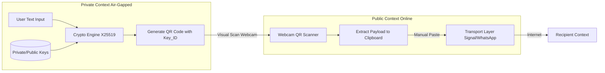
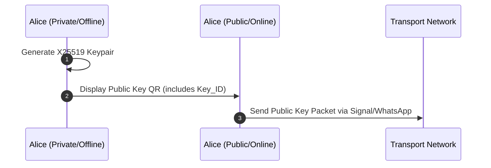
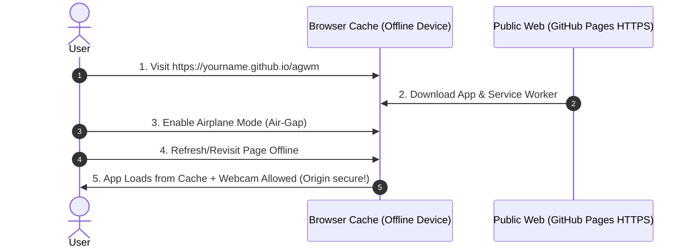

# Air-Gapped Messenger (AGM)

## Architectural Design & Specification

### 1. Concept Statement

An asymmetric, ultra-secure messaging system that eliminates operating-system and network-based attack vectors by isolating cryptographic key generation, message encryption, and decryption on a device physically disconnected from the internet (*air-gapped*). The system leverages a 100% web-based architecture (Flutter Web / HTML5) to maximize accessibility and deployment ease. It utilizes existing commercial messaging networks (e.g., Signal, WhatsApp) as blind data transport relays ("postmen") for encrypted, anonymized payloads via effortless QR code scanning and clipboard orchestration.

---

### 2. Problem Statement

Modern communication channels expose high-risk users to three critical threat vectors:

1. **Key Compromise:** If an internet-connected device is infected with malware, private cryptographic keys can be exfiltrated silently.
2. **Operating System:** If an internet-connected device is infected with malware, unencrypted messages can be accessed from memory or from the frame buffer.
3. **Metadata Harvesting:** Even with End-to-End Encryption (E2EE), network providers and state actors log the social graph—tracking who communicates with whom, when, and how frequently.

Traditional air-gapped systems mitigate key compromise but introduce extreme friction, requiring manual string transcription, specialized hardware, or proprietary network deployments that are unsustainable for casual or rapid deployment.

---

### 3. Conceptual Design

#### Architecture Overview

The system splits operations between two execution contexts running the exact same Application, distinguished only by their network state.



#### Core Components & Device Roles

1. **Private Context (Offline / Air-Gapped Device):**
* **Role:** Key custodian and secure terminal.
* **Functions:** Generates public/private key pairs, stores peer public keys locally, encrypts outgoing plaintext, and decrypts incoming ciphertexts.
* **Network State:** Permanent airplane mode. For demo purposes, intially loaded once via HTTPS, then disconnected. Full airgap mode is possible by serving the html via local micro-server, to get around browser camera restrictions.  


2. **Public Context (Online / Sender-Relay Device):**
* **Role:** Automated data courier.
* **Functions:** Scans outgoing QR codes from the Private Device, auto-copies payloads to the system clipboard, and displays incoming network payloads as QR codes for the Private Device to consume.
* **Network State:** Connected to the internet. **Zero knowledge** of private keys.


#### Cryptographic Key & Metadata Schema

To prevent third-party observers from linking network transactions to real-world identities, the system uses ephemeral or rotatable key mappings indexed by a randomized identifier (`Key_ID`).

* **`Key_ID`**: The first 8 bytes of the SHA-256 hash of the specific Public Key.
* **Anonymization:** Network payloads only expose the `Key_ID` in plaintext, leaving the sender and recipient identities completely hidden from passive network interceptors.

#### QR Code Payload Structure

Data exchanged via QR code uses a tight, structured JSON format containing a plaintext metadata block and an asymmetric ciphertext payload:

```json
{
  "meta": {
    "v": "1.0",
    "kid": "a1b2c3d4"
  },
  "pay": "hQEMAwAAAAAAAAAAAQEAA/9X..."
}

```

* **`meta.v`**: Protocol version string.
* **`meta.kid`**: Plaintext `Key_ID` hint. Used by the receiving Private Device to select the appropriate decryption key from local storage.
* **`pay`**: Armor-encoded ciphertext encrypted using Curve25519 (X25519) key exchange combined with symmetric authenticated encryption (ChaCha20-Poly1305).

---

### 4. Application Workflows

#### Key Exchange Procedure (Initial Setup)

Before secure messaging begins, users execute a one-time cryptographic handshake:



#### Workflow A: Outbound Message (Private $\rightarrow$ Public $\rightarrow$ Network)

1. **Private Terminal:** User selects a peer, types a message, and clicks "Encrypt". The app fetches the peer's Public Key, seals the payload, appends the target `Key_ID` to the metadata, and renders the JSON string as a QR code.
2. **Public Relay:** The online device scans the QR code via the browser webcam. The app parses the JSON, flashes a success indicator, and **automatically copies the `pay` string directly to the device clipboard**.
3. **Dispatch:** The user switches to their preferred native messaging app (Signal/WhatsApp), enters the recipient's chat room, pastes the clipboard contents, and clicks send.

#### Workflow B: Inbound Message (Network $\rightarrow$ Public $\rightarrow$ Private)

1. **Public Relay:** The user copies the incoming encrypted string from Signal/WhatsApp, opens the AGM Web App, and pastes it into the incoming terminal interface. The Web App converts this data into a fullscreen QR code.
2. **Private Terminal:** The user scans the public display using the offline device's webcam.
3. **Decryption:** The offline app extracts `meta.kid`, locates the matching private key in its local browser state, decodes the ciphertext payload, and prints the plaintext message to the screen.

---

### 5. Technical Stack & Browser Sandbox Mitigations

#### Chosen Framework: Flutter Web

* **Language:** Dart
* **Deployment Target:** Web (WASM / JavaScript compilation optimized for single-page application execution).
* **Cryptographic Layer:** `cryptography` package or native Web Crypto APIs executing standard `X25519` and `ChaCha20-Poly1305`.

#### Bypassing Browser Constraints in Air-Gap Environments

Web Browsers impose strict **Secure Context** rules (`window.isSecureContext`). Hardware access APIs—specifically `navigator.mediaDevices.getUserMedia` for the webcam—are completely blocked if a page is served over unencrypted channels or via raw local file paths (`file:///`).

To deliver a zero-install, 100% web experience without setting up local development servers or modifying native browser flags on the air-gapped device, the architecture utilizes the **Persistent Service Worker Cache** strategy:



1. **Initial Hydration:** While safely connected to the internet, the user navigates the target air-gap device to the GitHub Pages URL (`https://[user].github.io/agwm`).
2. **Service Worker Interception:** The app installs a Service Worker that caches all application bundles (`.wasm`, `.js`, assets) locally within the browser's persistent storage engine.
3. **Air-Gap Activation:** The user completely severs the device's physical and wireless network links (enabling permanent Airplane Mode).
4. **Execution:** Because the browser tracks that the origin domain was successfully verified over `https://`, it treats the application environment as a **Secure Context** indefinitely. The user can refresh the page or reboot the device; the app will boot straight from the offline cache, and the webcam will remain fully functional without ever making a network request.

#### Local Network Development

If you are developing or testing AGM locally and want to access the dev server from your mobile device on the same Wi-Fi network (to test webcam scanning), you must use HTTPS. This project uses `@vitejs/plugin-basic-ssl` to automatically provide a self-signed certificate for the local dev server.

**Important Caveat for Mobile Webcams:**
When accessing the local development URL (`https://<your-local-ip>:5173`) from your phone, you will encounter a "connection is not private" warning because the certificate is self-signed. You can bypass it to view the page. However, modern mobile browsers (especially Chrome on Android) may **still block the webcam** because they do not consider self-signed local IPs to be a fully secure context.

To bypass this restriction on Chrome for Android during development:
1. Navigate to `chrome://flags/#unsafely-treat-insecure-origin-as-secure`
2. Enable the flag.
3. Add your local development URL (e.g., `http://192.168.x.x:5173`) to the text box.
4. Restart the browser.

This explicitly trusts your local development IP, allowing the webcam to work locally without a valid public certificate.
